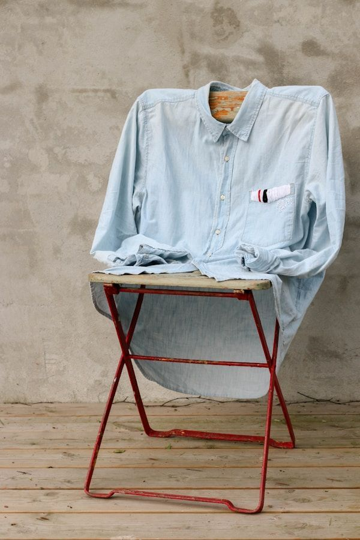

# 图片优化指南 - Luxury Trading

## 概述
本指南提供优化网站图片的具体步骤，以提升页面加载速度和用户体验。

## 当前问题
1. 产品图片文件名不统一（如 `perfume-custom.jpg` 用于多个不同产品）
2. 缺少现代图片格式（WebP、AVIF）支持
3. 没有响应式图片实现
4. 部分图片可能未压缩

## 优化步骤

### 1. 图片压缩
使用以下工具压缩现有图片：

**在线工具：**
- [TinyPNG](https://tinypng.com/) - PNG/JPG压缩
- [Squoosh](https://squoosh.app/) - 高级压缩选项
- [Compressor.io](https://compressor.io/) - 批量压缩

**命令行工具：**
```bash
# 安装 ImageMagick
# Windows: choco install imagemagick
# Mac: brew install imagemagick

# 批量压缩 JPG
mogrify -quality 85 *.jpg

# 批量压缩 PNG
mogrify -strip -quality 85 *.png
```

### 2. 转换为现代格式

**生成 WebP 格式：**
```bash
# 将 JPG/PNG 转换为 WebP
cwebp -q 85 image.jpg -o image.webp
cwebp -q 85 image.png -o image.webp

# 批量转换
for i in images/products/*.jpg; do cwebp -q 85 "$i" -o "${i%.*}.webp"; done
```

**生成 AVIF 格式（更优压缩）：**
```bash
# 使用 avifenc (需要安装 libavif)
avifenc -q 65 image.jpg image.avif
```

### 3. 实现响应式图片

**HTML 示例：**
```html
<picture>
    <!-- AVIF format (best compression) -->
    <source srcset="images/products/jacket1.avif" type="image/avif">
    
    <!-- WebP format (good compression, wide support) -->
    <source srcset="images/products/jacket1.webp" type="image/webp">
    
    <!-- Fallback JPG/PNG -->
    
</picture>
```

**更新 products.json 中的图片路径：**
```json
{
    "id": "c001",
    "name": "Supreme FW25 反光夹克",
    "nameEn": "Supreme FW25 Reflective Jacket",
    "images": [
        "images/products/jacket1.jpg",
        "images/products/jacket1.webp",
        "images/products/jacket1.avif"
    ],
    ...
}
```

### 4. 统一图片命名规范

**建议的命名规则：**
```
格式: {产品ID}_{序号}_{尺寸?}.{格式}

示例:
- c001_01.jpg (主图)
- c001_02.jpg (细节图1)
- c001_03.jpg (细节图2)
- c001_thumb.jpg (缩略图)
- c001_800x1000.jpg (特定尺寸)
```

**重命名脚本（PowerShell）：**
```powershell
# 备份原图
Copy-Item -Path "images/products/*.jpg" -Destination "images/products/backup/"

# 根据 products.json 重命名
# (需要编写具体脚本根据ID重命名)
```

### 5. 添加图片尺寸属性

**在 CSS 中预设产品图片容器尺寸：**
```css
.product-image {
    position: relative;
    width: 100%;
    padding-top: 125%; /* 4:5 宽高比 */
    overflow: hidden;
    background: var(--color-secondary);
}

.product-img-simple {
    position: absolute;
    top: 0;
    left: 0;
    width: 100%;
    height: 100%;
    object-fit: cover;
    transition: transform 0.6s ease;
}
```

### 6. 实现懒加载

**HTML（已添加 loading="lazy"）：**
```html

```

**JavaScript 懒加载回退（不支持 loading 属性的浏览器）：**
```javascript
// 已包含在 script-optimized.js 中
if ('loading' in HTMLImageElement.prototype) {
    // 浏览器原生支持懒加载
} else {
    // 回退到 Intersection Observer
    const imageObserver = new IntersectionObserver((entries) => {
        entries.forEach(entry => {
            if (entry.isIntersecting) {
                const img = entry.target;
                img.src = img.dataset.src;
                img.removeAttribute('data-src');
                imageObserver.unobserve(img);
            }
        });
    });
    
    document.querySelectorAll('img[data-src]').forEach(img => {
        imageObserver.observe(img);
    });
}
```

## 优化前后对比

| 指标 | 优化前 | 优化后（预期） |
|------|---------|----------------|
| 首页图片总大小 | ~2.5MB | ~800KB |
| 图片数量 | 10张 | 10张 (多格式) |
| 加载方式 | 全部立即加载 | 懒加载 + 现代格式 |
| Lighthouse 性能分 | 待测试 | 预期 90+ |

## 执行清单

- [ ] 备份现有图片 (`images/products/backup/`)
- [ ] 压缩所有 JPG/PNG 图片
- [ ] 生成 WebP 格式图片
- [ ] 生成 AVIF 格式图片（可选）
- [ ] 更新 HTML 使用 `<picture>` 元素
- [ ] 更新 `products.json` 包含多格式路径
- [ ] 添加图片尺寸属性到 CSS
- [ ] 测试懒加载功能
- [ ] 使用 Lighthouse 验证改进

## 自动化脚本（可选）

**使用 Gulp 自动化：**
```javascript
// gulpfile.js
const gulp = require('gulp');
const imagemin = require('gulp-imagemin');
const webp = require('gulp-webp');
const avif = require('gulp-avif');

// 压缩 JPG/PNG
gulp.task('images', () => {
    return gulp.src('images/products/*.{jpg,png}')
        .pipe(imagemin())
        .pipe(gulp.dest('images/products/optimized'));
});

// 生成 WebP
gulp.task('webp', () => {
    return gulp.src('images/products/*.{jpg,png}')
        .pipe(webp({ quality: 85 }))
        .pipe(gulp.dest('images/products/webp'));
});

// 生成 AVIF
gulp.task('avif', () => {
    return gulp.src('images/products/*.{jpg,png}')
        .pipe(avif({ quality: 65 }))
        .pipe(gulp.dest('images/products/avif'));
});

gulp.task('default', gulp.parallel('images', 'webp', 'avif'));
```

## 监控和维护

1. **定期检查**：每月检查图片是否是最新优化版本
2. **新图片流程**：所有新上传图片必须经过压缩和格式转换
3. **性能监控**：使用 Google PageSpeed Insights 持续监控

## 资源链接

- [WebP 格式详解](https://developers.google.com/speed/webp)
- [AVIF 格式介绍](https://caniuse.com/avif)
- [响应式图片指南](https://developer.mozilla.org/en-US/docs/Learn/HTML/Multimedia_and_embedding/Responsive_images)
- [图片优化最佳实践](https://web.dev/performant-images/)
